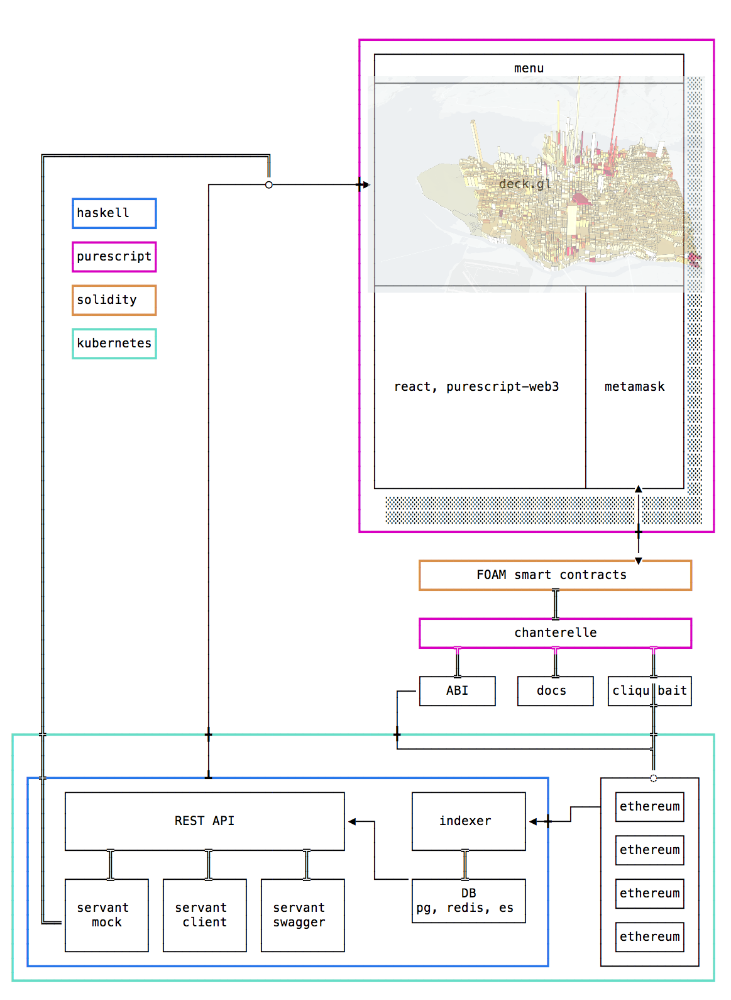
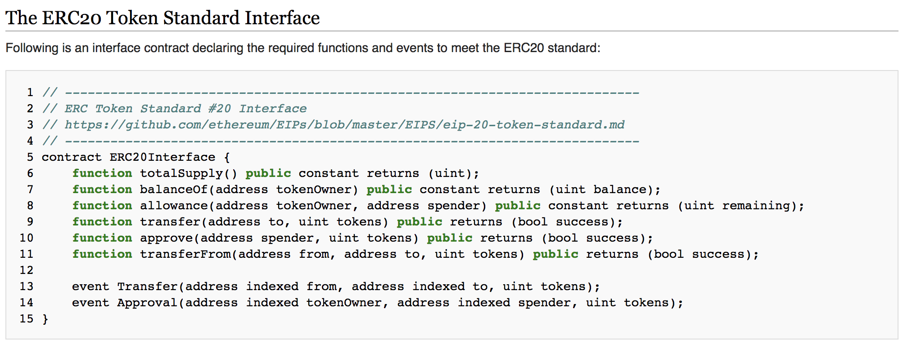
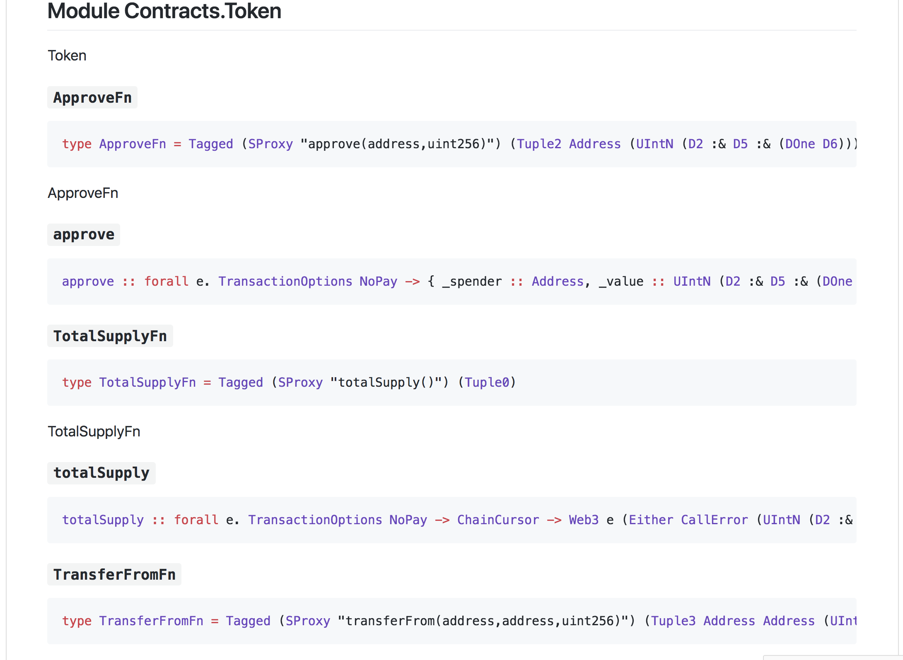

---

# Architecting an Ethereum App

## What does it look like?

<center>
<a href="https://raw.githubusercontent.com/f-o-a-m/mayday-presentation/master/images/foam-architecture.png">

</a>
</center>

## Auto-generated FFI

- Ethereum smart contracts expose an interface
- Example: ERC20 standard

<a href="https://theethereum.wiki/w/index.php/ERC20_Token_Standard">

</a>
</center>

---

## Auto-generated FFI

- Use the Application Binary Interface (ABI) as a specification

```json
 {
    "inputs": [
      {
        "name": "from",
        "type": "address"
      },
      {
        "name": "to",
        "type": "address"
      },
      {
        "name": "value",
        "type": "uint256"
      }
    ],
    "name": "transferFrom",
    ....
  }
...

```

---

## Auto-generated FFI

- Auto generate purescript or haskell code for FFI
<center>
<a href="https://github.com/f-o-a-m/recurse-presentation/blob/master/generated-docs/Contracts/Token.md">

</a>
</center>

---

## Functional Web3 Libraries
- [purescript-web3](https://github.com/f-o-a-m/purescript-web3): A web3 client library for purescript. Capable of generating client libraries for smart contracts from Solidity ABIs. Integrates with services like Metamask or uPort for in-browser transaction signing. Plays very nicely with [Chanterelle](https://github.com/f-o-a-m/chanterelle).
- [hs-web3](https://github.com/airalab/hs-web3): A haskell web3 client library. Also capable of creating client libraries from ABIs using Template Haskell.

## Library Layout

- Low level serialization and RPC layer
- - Solidity types
- - (de)serialization
- - web3 api

- User Interface and Generator Tool
- - purescript-web3 generator
- - `Contract` module
- - Methods and Events

---

## Solidity Types

---

### Sized Types
- Purescript does not have type level naturals, but we don't need infinitely many

```haskell
module Network.Ethereum.Web3.Solidity.Size where

foreign import data D0 :: Digit
...
foreign import data D9 :: Digit
data (:&) :: Digit -> DigitList -> DigitList

class KnownSize (d :: DigitList)
class KnownSize n <= ByteSize n
class KnownSize n <= IntSize n
```

---

### Sized Ints

- js doesn't have unbounded integers (doesn't even have integers!)
- need something like `BigNumber`

```haskell
newtype UIntN n = UIntN BigNumber

uIntNFromBigNumber 
  :: forall n . KnownSize n
  => BigNumber
  -> Maybe (UIntN n)

type UInt = UIntN S256
```

---

### Length Indexed Vectors

```haskell
newtype Vector (n :: DigitList) a = Vector (Array a)

nilVector :: forall a . Vector (DOne D0) a

vCons 
  :: forall a n nInc
   . Inc n nInc 
  => a 
  -> Vector n a 
  -> Vector nInc a
infixr 6 vCons as :<
```

---

### Length Indexed Vectors (contd.)

```haskell
toVector 
  :: forall a n 
   . KnownSize n 
  => DLProxy n 
  -> Array a 
  -> Maybe (Vector n a)

bools :: Vector (DOne D3) Boolean
bools = true :< false :< true :< nilVector
```

---

### Tuples
- The EVM limits the possible tuple sizes.
- First iteration of `purescript-web3` didn't handle these well.

```haskell
data Tuple0 = Tuple0

newtype Tuple1 a = Tuple1 a

...

data Tuple16 a b c d e f g h i j k l m n o p =
  Tuple16 a b c d e f g h i j k l m n o p

```
---

## Basic Codecs
- All basic Solidity types implement the following type classes for the ABI encoding schema.

```haskell
class ABIEncode a where
  toDataBuilder :: a -> HexString

class ABIDecode a where
  fromDataParser :: Parser String a
```

## Basic Codecs (contd.)

```haskell
instance abiEncodeIntN
  :: IntSize n 
  => ABIEncode (IntN n) where
  toDataBuilder a = int256HexBuilder <<< unIntN $ a

instance abiDecodeIntN 
  :: IntSize n 
  => ABIDecode (IntN n) where
  fromDataParser = do
    a <- int256HexParser
    maybe (fail $ msg a) pure <<< intNFromBigNumber (DLProxy :: DLProxy n) $ a
    where
      msg n = let size = sizeVal (DLProxy :: DLProxy n)
              in "Couldn't parse as int" <> show size <> " : " <> show n
```

---

## Tuples
- All Solidity functions accept and return tuples.
- Events are emitted as tuples, though not as straight forward to handle.
- Encoding and Decoding implemented "generically".

---

## Generics Primer (Advanced)
- All "basic" purescript types (i.e. of kind `Type`) admit a generic decomposition

```haskell
data Argument a = Argument a
data Product a b = Product a b
data Constructor (s :: Symbol) a = Constructor a

from (Tuple3 Bool String (UIntN (DOne 8)) ::
  Constructor "Tuple3" (Product (Argument Bool) (Product (Argument String) (Argument UInt (DOne D8))))
```

---

## Generics Primer (Advanced)
- Compiler implements generic decompositions for us, so we can use them for free.
- We can inductively build up generic types to have a certain property, such as `ABIEncode`

```haskell
instance genericEncodeBase 
  :: ABIEncode a
  => GenericABIEncode (Argument a)

instance genericEncodeInductive 
  :: ( ABIEncode a
     , GenericABIEncode b
     )
  => GenericABIEncode (Product (Argument a) b)
```

---

## Generics
- enables extremely local reasoning, building up more complicated expressions from smaller ones whose correctness is easier to prove.
- code utilizing "generics" is extremely reusable.

```haskell
genericEncode 
  :: forall a rep
   . Generic a rep
  => GenericABIEncode rep
  => a
  -> HexString
genericABIEncode = genericToDataBuilder <<< from

```
---

## Web3 API
- The Web3 API is a set of RPC methods that the ethereum client knows about
- Type signatures serve as a sort of [documentation](https://pursuit.purescript.org/packages/purescript-web3/0.9.0/docs/Network.Ethereum.Web3.Api)

```haskell
eth_sendTransaction 
  :: forall e 
   . TransactionOptions Wei 
  -> Web3 e HexString

eth_newFilter 
  :: forall a e 
   . Filter a 
  -> Web3 e FilterId

eth_getFilterChanges 
  :: forall e 
   . FilterId 
  -> Web3 e (Array Change)
...
```

---

## Web3 API
- How easy is it to add new endpoints as they are released?
```haskell
personal_sign 
  :: forall e
   . HexString 
  -> Address 
  -> Maybe String 
  -> Web3 e HexString
```
[Pretty easy!](https://github.com/f-o-a-m/purescript-web3/blob/master/src/Network/Ethereum/Web3/Api.purs)

---

## User Interface
You will be able to use `purescript-web3` without knowing how it works. This means:

1. Calling contract methods, listening for events, querying blockchain metadata, full web3 api implementation.
2. Integrating with metamask.
3. Easily generate a simple client library for every contract.

---

## Generator - Simple Storage
Simple Storage allows us to change a `uint256`, query that state, and listen for updates to that state.

```javascript
contract SimpleStorage {
    uint public count;
    event CountSet(uint _count);
    function setCount(uint _count) {
        count = _count;
        CountSet(_count);
    }
}
```

## Generator - Simple Storage
Here is the client library generated which is generated from the ABI [^1]

```haskell
count 
  :: forall e
   . TransactionOptions NoPay 
  -> ChainCursor 
  -> Web3 e (Either CallError (UIntN S256))
 
setCount 
  :: forall e
   . TransactionOptions Wei 
  -> { _count :: (UIntN S256) } 
  -> Web3 e HexString

newtype CountSet = CountSet { _count :: UIntN S256 }
```
[^1]: There are a few other boiler plate type declarations that are generated, but this is pretty much it.

---

## Generator - Benefits
1. Reduce boiler plate.
2. You don't want to access the raw encoders/decoders manually when templating your transactions, laborious and potentially error prone.
3. The generator is meant to be run as an `npm build` step - any breaking changes to your contracts will cause compile time errors in your application.
4. Specially generated types allow for higher levels of abstraction in library.

---

## Generator - How does it work
- All templated transaction functions are run with the `sendTx` method:

```haskell
class TxMethod (selector :: Symbol) a where
    -- | Send a transaction for given contract 'Address', value and input data
    sendTx :: forall e u.
              EtherUnit (Value u)
           => IsSymbol selector
           => TransactionOptions u
           -> Tagged (SProxy selector) a
           -- ^ Method data
           -> Web3 e HexString
           -- ^ 'Web3' wrapped tx hash

```
- `call` methods are similar, but with a return type

---

## Generator - Events
 - Events were difficult to find a good solution for due to the Ethereum log structure.
 - All events can be handled with the `event` method, which similarly defined in `hs-web3`
 - This looks more complicated than it is..


```haskell
event 
  :: forall e a i ni
   . DecodeEvent i ni a
  => Filter a
  -> (a -> ReaderT Change (Web3 e) EventAction)
  -> Web3 e Unit

```
---

## Events - Example
- Here's an example of the event monitor in the example app. It registers a handler and asynchronously polls a filter for the `CountSet` event, updating the React component's state.

```haskell
monitorCount 
  :: R.ComponentDidMount CountStateProps (UIntN S256) (eth :: ETH | eff)
monitorCount this = void $ do
  props <- R.getProps this
  let countFilter = eventFilter (Proxy :: SimpleStorage.CountState)
  launchAff do
    void $ runWeb3 metamask $
      event config.simpleStorageAddress $ \(SimpleStorage.CountSet cs) -> do
      _ <- liftEff <<< R.transformState this $ _{currentCount = cs._count}
      pure ContinueEvent
```
---
