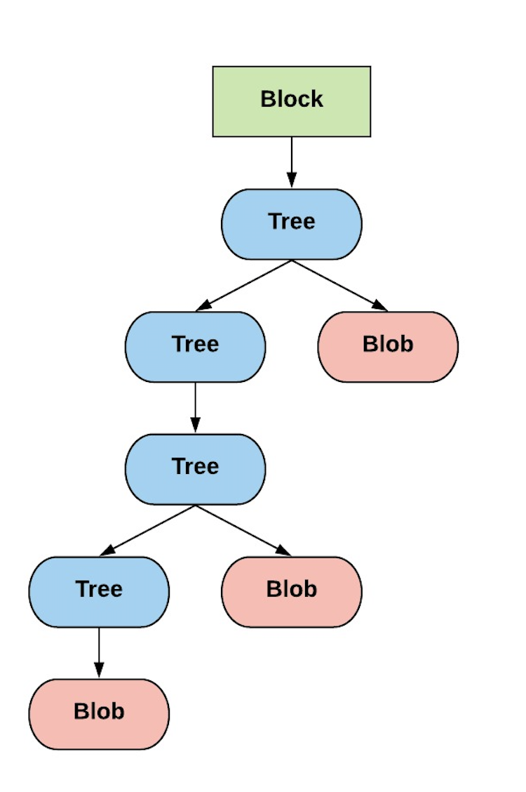
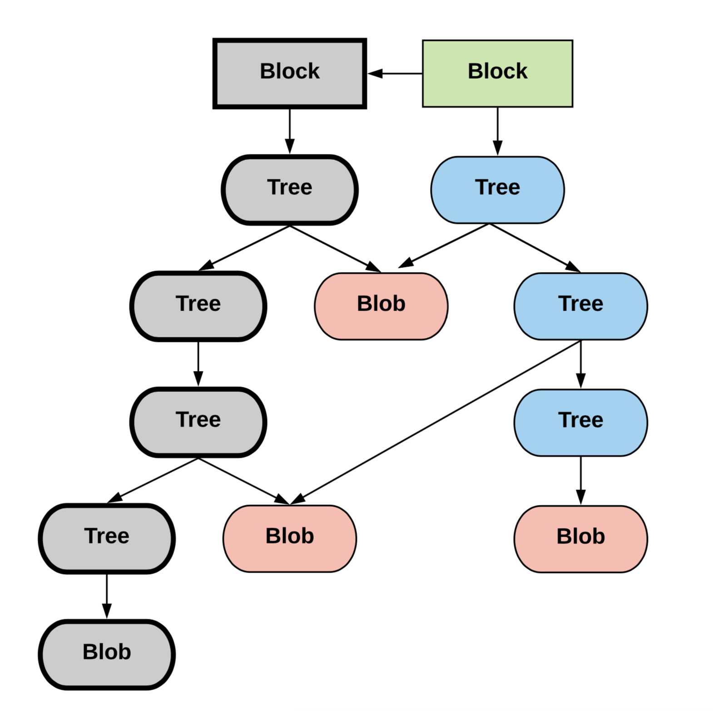
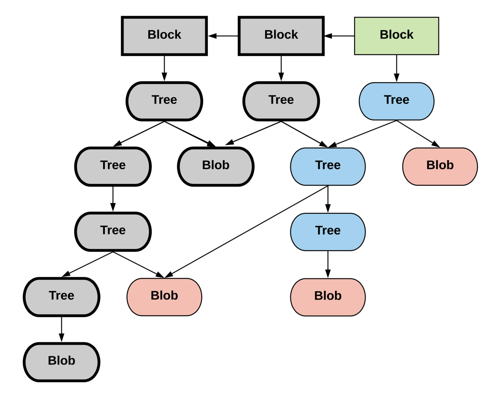
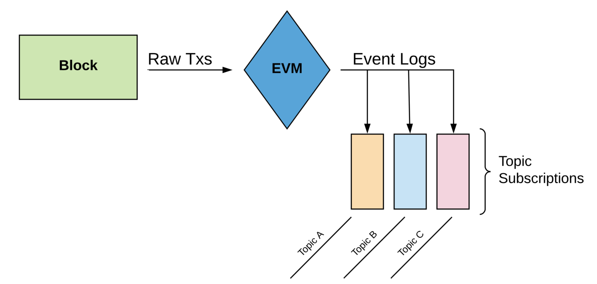

---

# Data Access and Streaming

---

## The Problem

- Node's primary concern is block production, propogation, and verification
- Internal storage model is cryptographic (Merkle) trees
- Query performance not a concern, better to use production grade databases where applicable (e.g. Postgres, Elasticsearch)

---

## Block Model

```json
{
  hash: "0xfc31...",
  number: 5840941,
  parentHash: "0x6a4d...",
  receiptsRoot: "0x17e8...",
  stateRoot: "0x5d10...",
  logsBloom: "0x4503...",
  transactionsRoot: "0xe7f0...",
  transactions: [
    "0x5465...",
    "0x7ce7...",
    ...
  ],
...
}
```
Takeaway: Lots of *roots*

---

## Ethereum Progression

Blocks carry an index into a storage tree, called a *state root*
<center>
<a href="https://raw.githubusercontent.com/f-o-a-m/recurse-presentation/master/images/foam-architecture.png">

</a>
</center>

** <sup>Images shamelessly adapted from Git Internals by Scott Chacon</sup>

---

## Ethereum Progression

Block progression gives a series of indices into storage
<center>
<a href="https://raw.githubusercontent.com/f-o-a-m/recurse-presentation/master/images/foam-architecture.png">

</a>
</center>

---

## Ethereum Progression

- want to stream relevant application updates, *events*
- want to access history (e.g. indexing, auditing, replaying)
- want to submit transactions to update this storage
<center>
<a href="https://raw.githubusercontent.com/f-o-a-m/recurse-presentation/master/images/foam-architecture.png">

</a>
</center>

---

## What Are These *Event Logs* Precisely?
- When Alice transfers Bob a token, balances in contract storage change but this act of exchange is not stored in contract.
- Outside world notified via subscriptions to contract's transfer topic.

<center>
<a href="https://raw.githubusercontent.com/f-o-a-m/recurse-presentation/master/images/foam-architecture.png">

</a>
</center>

---

