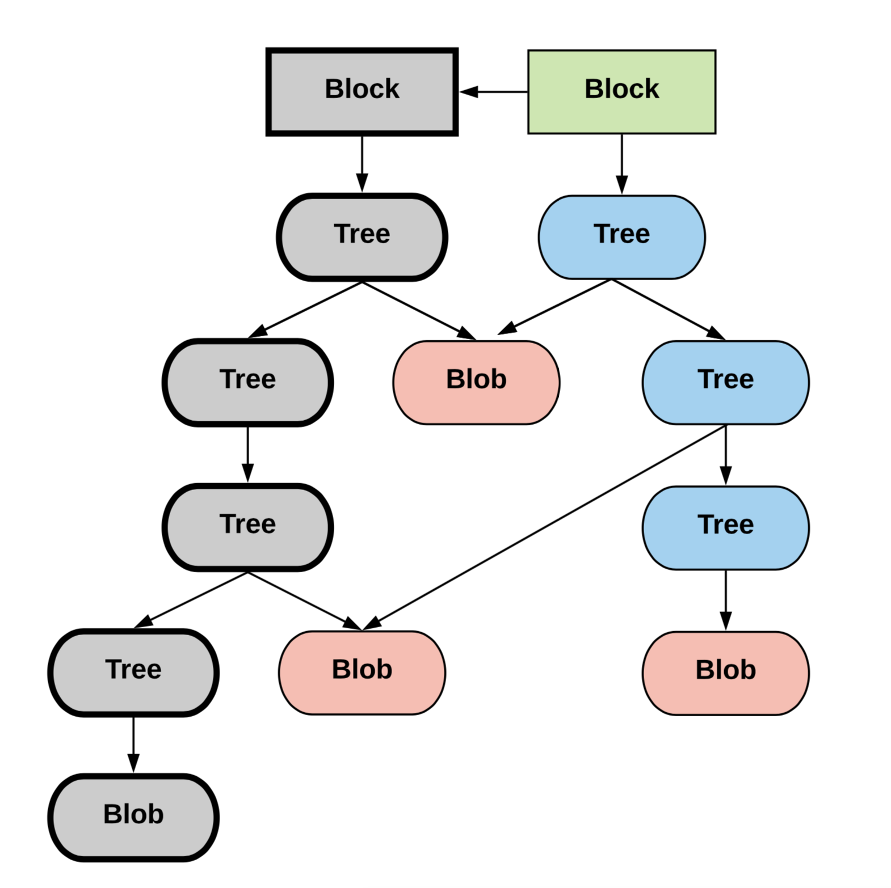
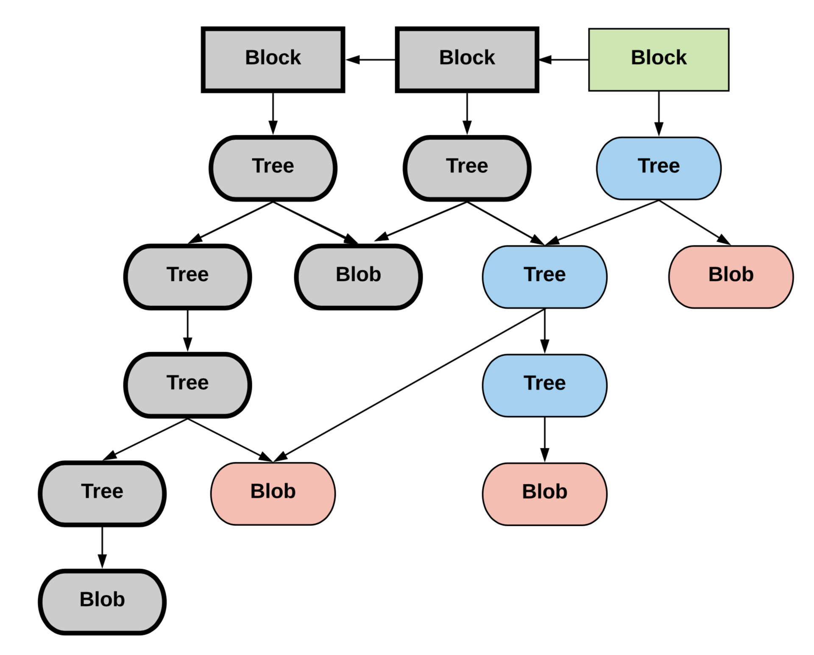
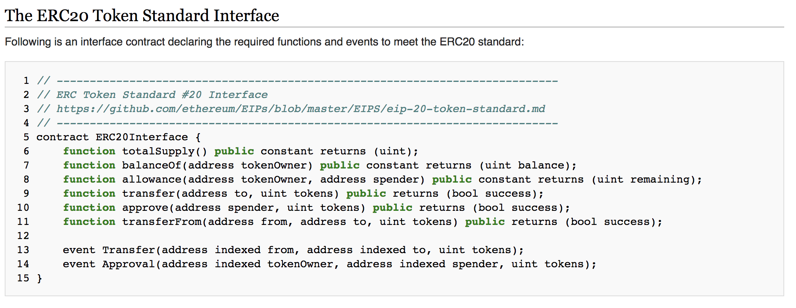

---

# The State of Haskell in Ethereum

author: Martin Allen, FOAM
date: June 27, 2018

---

# Introduction

- What is Ethereum? Where does it fit?
- What makes Ethereum development "difficult"?
- What off the shelf haskell libraries can help?

---

## Blockchain vs Cryptocurrency

- Cryptocurrency ~ programmable money
  - access control
  - specified utility
  - scarcity

- Blockchain  ~  ⊥
  - process digital assets<sup>1</sup>
  - cryptographic<sup>2</sup>
  - distributed

<sub>[1] This is currently the primary use case, but all work is leading towards more general use cases, e.g. governance.</sub>
<sub>[2] In the sense of cryptographic hash functions.</sub>

---

## Blockchains in Production
- Existing: Bitcoin, Ethereum
- Nascent: Kadena, Cardano SL, RChain

---

## Ethereum Today
- Only public, permissionless, 2nd generation blockchain in production 
- Largest developer community
- Will be here for a while...

---

## Example Applications

- Tokenized Assets
  - Digital Art -- [SuperRare](https://github.com/f-o-a-m/chanterelle-halogen-template), [CryptoKitties](https://github.com/f-o-a-m/purescript-kitty-monitor)
  - Intellectual Property / Licensing

- Digital Registries
  - Ad Tech -- [ad chain](https://publisher.adchain.com/domains)
  - Geospatial Data -- [FOAM](https://beta.foam.space/app)

---

# Data Access and Streaming
(An Ethereum Node's point of view)

---

## The Problem

- Node's primary concern is block production, propogation, and verification
- Query performance and expression are not primary concerns.
 
**Solution**: Wherever applicable, use production grade databases as a history cache (e.g. Postgres, Elasticsearch).

---

## Access Model

Libraries give the appearance of a high level interface:
```haskell
-- | Get the token balance for a user
balanceOf 
  :: ContractAddress
  -> BlockNumber
  -> UserAddress
  -> Web3 TokenBalance
balanceOf = ...
```

Internally, the low level interface is key value storage:

```haskell
getValue :: ByteString -> Maybe ByteString
```

---

## Ethereum Storage

- Internal storage model is cryptographic (Merkle) tree, not meant for Enterpiseâ„¢ data access.
- Each block contains a different index into this tree, indicating the current state.
 
<center>

</center>


---

## Ethereum Block Progression

- Storage is never overwritten.
- Block progression gives a series of indices into storage, i.e. Ethereum is a *time-indexed database*.

<center>

</center>

---

## Ethereum Block Progression

- Smart Contract state changes *could* be inferred via tree diffs.
- *Events* are the mechanism to observe and react to state changes for external applications.
<center>

</center>

---

## What Are These *Event Logs* Precisely? (Example)

Example:

- Alice transfers Bob a token.
- Their balances in contract storage change (new state tree index). 
- This act of exchange `Transfer(Alice, Bob, 1)` is not stored in the contract-- it isn't even accessable.
- Outside world notified via contract's *Transfer* topic.

---

## What Are These *Event Logs* Precisely? (Illustration)

```haskell
processBlock
 :: Block
 -> StateT StateTree (Writer EventLog) ()
```

<center>

</center>

---

# Functional Tools

---

## Minimal web3 Library Requirements


- stream relevant Smart Contract updates, i.e. *events*
- access state history (e.g. indexing, auditing, replaying)
- submit transactions to update the blockchain

---


## Core Functional Ethereum Libraries
 - ### hs-web3
 - purescript-web3 - similar design to hs-web3.
 - chanterelle - smart contract build/deploy/test.

---


## Interacting with Smart Contracts

- Ethereum smart contracts expose an interface
- Example: ERC20 standard

<a href="https://theethereum.wiki/w/index.php/ERC20_Token_Standard">

</a>
</center>

---

## Interacting with Smart Contracts (ABI)
- Compliation artifact called ABI (application binary interface)
- JSON object specifying interface:
  - function calls
  - events / topics
- minimum data about contract required to generate FFI in any language (ps, haskell).

---

## Interacting with Smart Contracts (QuasiQuoter)

```haskell
[abiFrom|".abis/ERC20.json"]
```
```haskell
...
-- | Transfer a quantity of tokens to an address.  
transfer :: Call -> Address -> UIntN 256 -> Web3 Hash

-- | Represents a 'Transfer' event log.
data Transfer = 
  Transfer { transferFrom :: Address
           , transferTo :: Address
           , transferValue :: UIntN 256
           } deriving (Show, Eq, Ord, Generic)
...
```

---

## Interacting with Smart Contracts (Encodings)

- Ethereum has its own binary encoding schema (ABI-codecs)
  - transactions are serialized *closures* (function + args)
  - events / topics
- codecs derived generically (`generics-sop`)
- all other required instances declared in QQ

---

#### Conclusion:
All datatypes and FFI needed to interact with *any* Smart Contract can be generated from the QuasiQuoter and used natively in any application.

---

# Streaming Logs

---

## Machines - *Ceci n'est pas une pipe*
- similar libraries:
  - *conduit*
  - *purescript-coroutines*
  - *pipes*
- Idea: build up data processing machines<sup>1</sup>, compose them, join them, split them.
- Useful for cases when streaming from one IO source to another with intermediate processing phases.


<sub>1. Usually build something called a _Plan_, which is a DSL describing what the machine should do and how to terminate.</sub>

---

## Analogous Problem
You want to stream all photos uploaded to some api by a user.
 - API supports `GET /photos/user_id`.
 - supports ws notifactions for new photos from a `user_id` after time `t`.

1. Break up the http requests into intervals, use a cursor.
2. Whenever you've caught up to the current time, start the ws.

This is what the SuperRare monitor is doing with Ethereum + IPFS.

---

## Filter Type Description

We send out a description of what we want to monitor.

```haskell
-- | Filter has a phantom type for the specific event.
data Filter e =
  Filter { address   :: [Address]
         -- ^ contract addresses for event origin.
         , fromBlock :: ChainCursor
         , toBlock   :: ChainCursor
         , topics    :: [Maybe ByteString]
         -- ^ Bloom filter to narrow this event filter.
         }         
```
Each match that comes back looks like this:

```haskell
data FilterChange e = 
  FilterChange { rawChange :: Change
               -- ^ event metadata (e.g. tx hash)
               , event     :: e
               -- ^ particular event (e.g. Transfer)
               }
```
---

## Filter Machines (slightly simplified)

There's an internal distinction between folding over past blocks and subscribing to current events (think of example problem).

Folding over past events:
```haskell
-- | Take a filter and split it into smaller intervals.
filterStream 
  :: FilterStreamState e
  -> MachineT Web3 k (Filter e)

-- | Stream past events until you are caught up to
-- the end of the filter's interval.
playLogs 
  :: DecodeEvent i ni e
  => FilterStreamState e
  -> MachineT Web3 k (FilterChange e)
```

<sub> Weirdly, all web3 machines are polymorphic in `k` </sub>
  
---

## Filter Machines (slightly simplified)

Subscribing to current events:

```haskell
-- | Poll the filter until a given block number
-- TODO: support ws
pollFilter 
  :: forall i ni e k . 
     DecodeEvent i ni e
  => Filter e
  -> MachineT Web3 k (FilterChange e)
```

Reduce a machine by running it:

```haskell
data EventAction = Continue | Terminate

-- | run while 'mapM_'ing with the given handler.
-- return conditions of termination.
reduceEventStream 
  :: Monad m
  => MachineT m k (FilterChange e)
  -> (e -> ReaderT Change m EventAction)
  -> m (Maybe (EventAction, BlockNumber))
```

---

## High level functions

There are also high level functions that don't require you to interface with machines.

```haskell
-- | Subscribe to the given filter, processing a number
-- | of blocks at a time with the handler until 
-- | possibly transitioning to polling or exiting.
eventMany 
  :: DecodeEvent i ni e
  => Filter e
  -> WindowSize
  -> (e -> ReaderT Change Web3 EventAction)
  -> Web3 ()
```
Ironically, I usually use this to feed a `Conduit` in all the data processing work that I do.

---

# Querying Data

---

## Haxl Interlude

<center>

</center>

---

## What is Haxl?

- Originally developed at Facebook, led by Simon Marlow
- Kind of like a scheduler for monadic computation
  - input "sequential", IO bound, monadic computation
  - will optimally<sup>1</sup> rewrite to parallalelize
  - sophisticated caching
- Really great for time indexed databases where you really don't want to do more work than you have to.


<sub>[1] Uses `{-# LANGUAGE ApplicativeDo #-}`. Not actually optimal (couldn't be anyway), uses heuristics to avoid slow compile times and still get good results.</sub>
  
---

## Example Computation
Suppose we have these functions:

```haskell
-- | Core logic generated by QuasiQuoter, 
--   queries web3 api.
balanceOf 
  :: MonadWeb3 m
  => BlockNumber 
  -> Address 
  -> m (UIntN 256)
...
  
-- | Uses our stored history of all token transfers.
getTraders
  :: MonadPg m
  => BlockNumber
  -> Address
  -> m [Address]
...

```

---

## Example Computation (*continued*)

Let **Neighbor** be a relations with **Neighbor(A,B)** if address A has traded with address B, where B currently has nonzero token balance.

```haskell
-- | Gets the 10 Neighbors with the highest token 
--   balances
getRichestNeighbors
  :: ( MonadWeb3 m
     , MonadPg m
     )
  => BlockNumber
  -> Address
  -> m [(Address, UIntN 256)]
getRichestNeighbors userAddress = do
  traders <- getTraders userAddress
  pairs <- forM traders $ \trader -> do
    bal <- balanceOf bn trader
    pure (trader, bal)
  let pairs' = filter ((> 0) . snd) pairs
  pure . take 10 . sortOn (snd . Down) $ pairs'
```

---

## Example Computation (*continued*)

Introduce another parameter `k` with **Neighbor'(A, B, k)** if
there exists A<sub>1</sub> ..., A<sub>i-1</sub> with `i <= k` and **Neighbor(A, A<sub>1</sub>)** ... 
**Neighbor(A<sub>i-1</sub>, B)**. 

In other words, A and B are at most `k` `Neighbor` pairs apart.

---

## Example Computation: Naive Approach

```haskell
getRichestNeighborsK
  :: (MonadWeb3 m, MonadPg m)
  => BlockNumber
  -> Int
  -> Address
  -> m [(Address, UIntN 256)]
getRichestNeighborsK bn k userAddress = do
  traders <- getAllTraders bn k userAddress
  pairs <- forM traders $ \t -> do
    bal <- balanceOf bn t
    pure (t, bal)
  let pairs' = filter ((> 0) . snd) pairs
  pure . take 10 . sortOn (snd . Down) $ pairs' 
  where
    getAllTraders _ 0 _ = pure []
    getAllTraders bn k userAddress = do
      traders <- getTraders userAddress
      concat <$> mapM (getAllTraders bn (k-1)) traders
```

---

## Example Computation: Problems
- `balanceOf` is possibly called multiple times per address.
- `getTraders` is possibly called multiple times per address.
- any time we used `mapM` (equivalently `forM`), we could be concurrently running each operation.

---

## Bad Solutions
- Run computation in `State` monad holding `MVar` with maps 
  - `traders :: Map Address [Address]`
  - `balances :: Map Address (UIntN 256)` 
- Use combination of `par` strategies and `async`/`wait`.

Building custom concurrency like this is tedious, fragile, and not always composible.

---

## Good Solutions
- Don't do anything at all.
- Let the compiler and libraries work for you.


---

## Haxl Solution

The analogy is:
- `Memory Management` is to `Garbage Collection` as `Concurrency` is to `Haxl`<sup>1</sup>

You might be able to do better with custom concurrency controls, but unlikely. Also, it's probably not the actual problem you're trying to solve at the moment.


<sub>[1] Simon Marlow [StrangeLoop 2017](https://www.youtube.com/watch?v=sT6VJkkhy0o) </sub>


---

## Haxl Scheduler Diagram

Not an AST!
This represents a dependency graph where 
sequential dependencies are marked with `(>>=)` and syncrhonization points with `(<*>)`.


---
